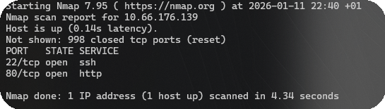

# BreakRSA - TryHackMe Writeup

**Room:** BreakRSA - THM  
**Difficulty:** Medium

## Introduction

Today I decided to tackle the BreakRSA room on TryHackMe. The room description mentioned something about a "deprecated cryptography library" and keys being generated poorly. That hinted that the challenge would be about weak key generation rather than brute force.

## Step 1: Reconnaissance

First, the machine was started and the VPN connection established, then an Nmap scan was launched against the target:
```bash
nmap -sC -sV breakrsa.thm
```


The scan showed SSH on port 22 and a web server on port 80, so the next logical step was to inspect the website on port 80.

## Step 2: Web Enumeration

The homepage was just a generic page, and viewing the source did not reveal anything useful, so directory brute forcing was performed with Gobuster:
```bash
gobuster dir -u http://breakrsa.thm -w /usr/share/wordlists/dirb/common.txt
```


Gobuster discovered a hidden directory containing a public key file named id_rsa.pub, which was downloaded for analysis.

## Step 3: Analyzing the Key

The file id_rsa.pub was a standard OpenSSH public key, so the modulus (n) and exponent (e) needed to be extracted:

```bash
ssh-keygen -f id_rsa.pub -e -m pem > key.pem
openssl rsa -pubin -in key.pem -text
```


The room hinted that the primes (p) and (q) used to generate the key were very close to each other, making the key vulnerable to Fermat's factorization method.

## Step 4: The Exploit (Scripting)

To exploit this weakness, a Python script was used to:
- Read the public key
- Extract n
- Apply Fermat's factorization to recover p and q
- Derive the private key
- Decrypt the protected data or use the key for access

> The Python script implementing Fermat's factorization is available in this repository: ./breakrsa_exploit.py

Running this script quickly recovered the two prime factors of n, which then allowed reconstruction of the private RSA key.

## Step 5: Getting the Flag

With the private key generated, it could be used to authenticate over SSH and get the Flag:
```bash
ssh -i ~/id_rsa_key root@breakrsa.thm
```


## Conclusion

This room demonstrates how using prime numbers that are too close together completely undermines RSA security, even if the key length itself looks large. It highlights the importance of strong randomness and proper key generation in cryptographic systems, since weak primes make the system trivial to break with classical attacks like Fermat's method.

## Links
- [BreakRSA - TryHackMe](https://tryhackme.com/room/breakrsa)
